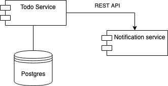

# Another TODO app in Python

## How to run

```bash
docker compose build
docker compose up -d
```

Then open http://localhost:8008/docs in your browser. You can try the endpoints there.

### Authentication

```
username: johndoe
password: secret
```

## Testing

```bash
cd todo_service
python3 -m unittest discover
```

```bash
cd notification_service
python3 -m unittest discover
```

## Technology stack

- Python 3.11
  - FastAPI
  - unittest
  - SQLAlchemy
  - Pydantic
  - aiohttp
- PostgreSQL
- Docker

## Architecture

- Todo service

  - Manages todos for user
  - Uses PostgreSQL as a database

- Notification service

  - Sends notifications about finished todos


